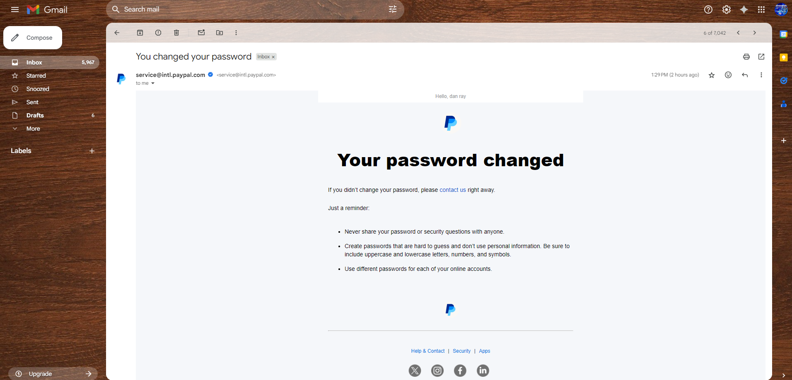
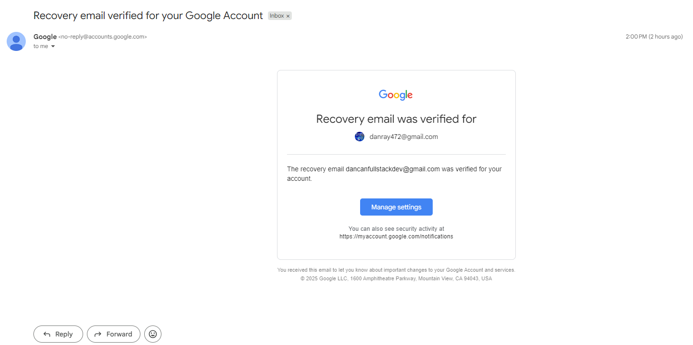
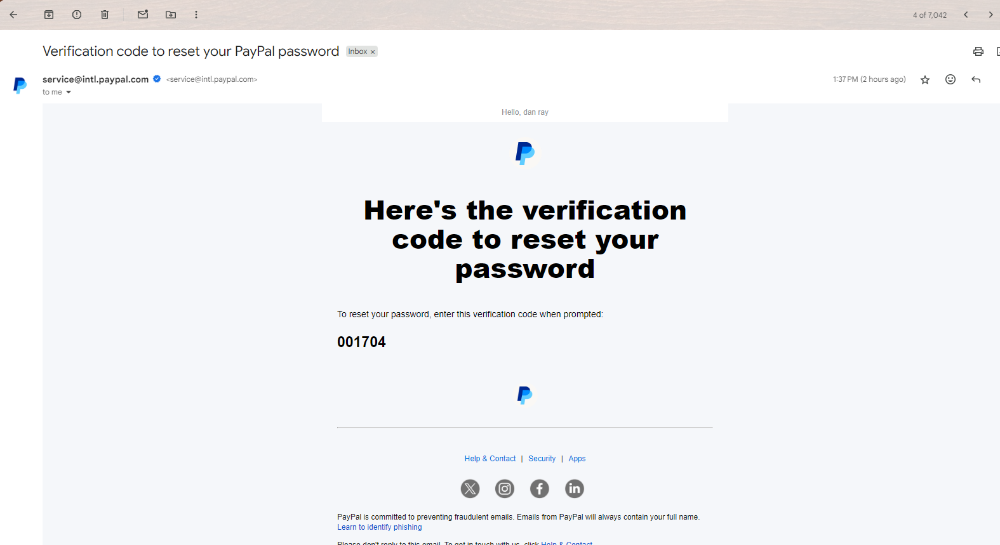
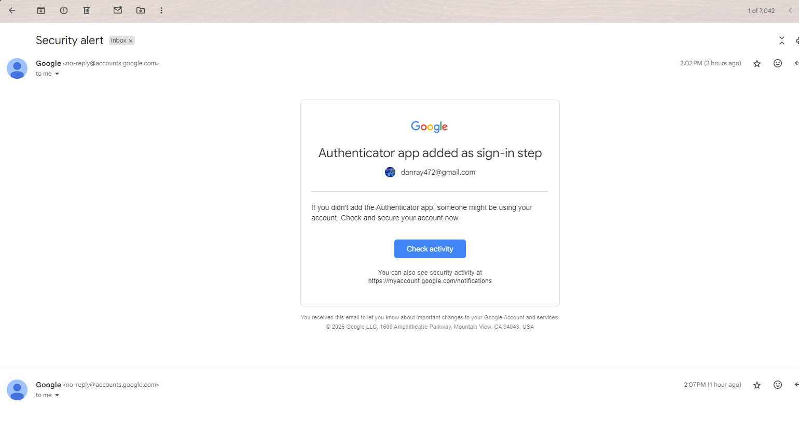

# 📅 Account Takeover Timeline: PayPal Incident

**Date of Incident:** [Insert actual date here]

---

### 🕵️ Summary

This file contains the full forensic timeline of how my PayPal account was taken over by an unknown attacker. It documents what I received, what I did, and what I observed — minute by minute.

---

### ⏱️ Timeline Table

| Time (Approx) | Event |
|---------------|-------|
| T-0 min | I receive an email from PayPal: **Your password has been changed** (not done by me) |
| +1 min | Email: **2FA has been enabled** via authenticator app |
| +2 min | Email: **A new email address was added:** `gabrielaharber8705@hotmail.com` |
| +4 min | I attempt to log in → it prompts for authenticator code I don't have |
| +5 min | I click “Forgot password” → PayPal responds: “This email is not associated with any account” |
| +6 min | I realize the attacker made their email primary and removed mine |
| +10 min | I try to act quickly, but access is already lost |

---

### 🖼️ Visual Evidence (Screenshots)

#### 🔐 Password Changed

#### 🧪 2FA Enabled by Attacker

#### 🧩 Attacker Added New Email

#### ❌ My Account Was Removed

#### 🔄 I Added a Recovery Email

#### 🚫 Failed Password Change Attempt

#### 🛡️ I Secured My Gmail With Authenticator  
> 📌 _Note: The screenshot below shows **me** enabling authenticator and 2FA on my Gmail account (linked to PayPal), after the incident — not the attacker._

---

### 💡 Important Clues

- My Gmail inbox shows **no login code** requests until *after* changes were made  
- Gmail account was *not* accessed or compromised  
- All attacker actions occurred within one valid PayPal session

---

### 🧠 Lessons from Timeline

- Attackers often act within minutes of logging in  
- Having access to login is enough to escalate unless platforms challenge critical actions  
- The absence of real-time alerts or confirmation flows weakens even large platforms like PayPal
