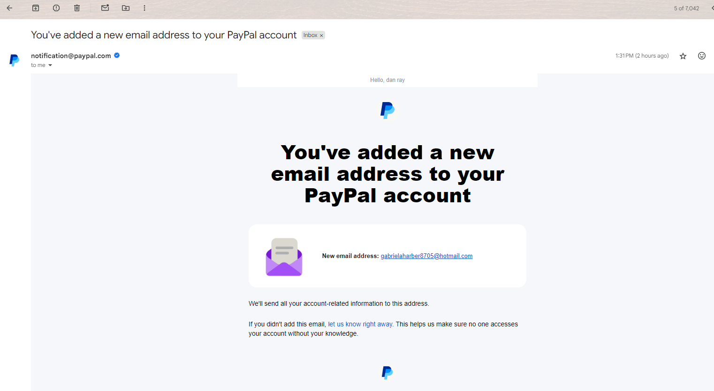
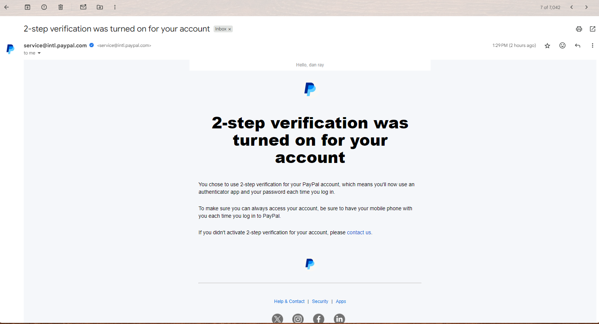
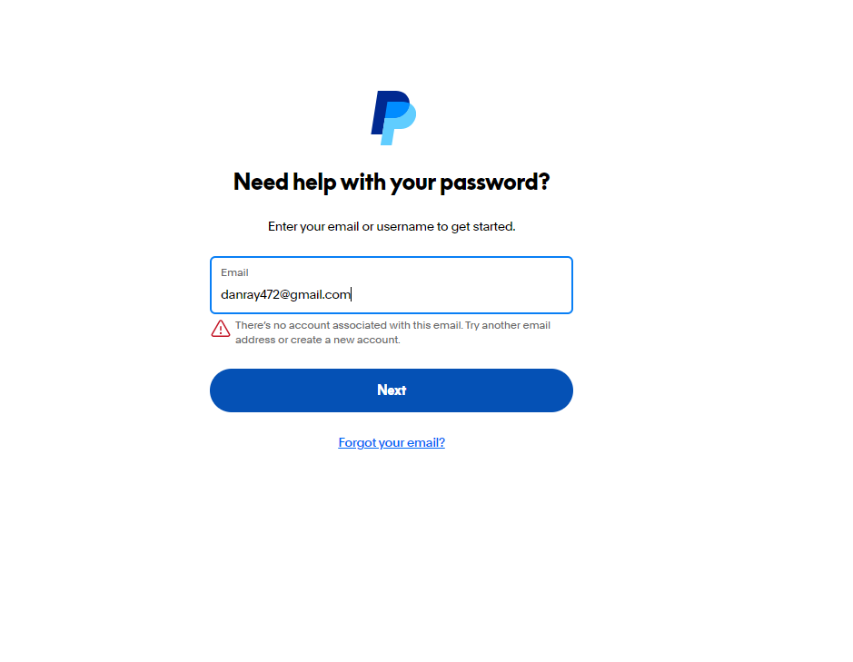

# 🛡️ PayPal Account Takeover: Real-World Case Study

**Author:** Dan Ray  
**Focus:** Cybersecurity Incident Analysis · Account Takeover (ATO) · Real-world Forensics

---

## 📌 Project Overview

This project documents a **real account takeover attack** I experienced on my PayPal account. Despite having no funds in the account, the attacker performed a full takeover, changing the password, email, and adding their own 2FA — locking me out completely.

> This project aims to reconstruct the attack, identify security flaws in PayPal's flow, and reflect on the experience as a cybersecurity student transitioning from development.

---

## 🧠 Key Files

| File | Description |
|------|-------------|
| [`01_case_reconstruction.md`](./01_case_reconstruction.md) | Detailed timeline of the ATO event with screenshots |
| [`02_security_flaws_analysis.md`](./02_security_flaws_analysis.md) | Analysis of where PayPal failed, including device verification flaws |
| [`04_defensive_controls.md`](./04_defensive_controls.md) | Recommendations for users and platforms |

---

## 📸 Visual Highlights

A real-world glimpse into how the attacker hijacked and locked me out of my PayPal account:

  
  

> Each step was captured and included in the forensic timeline.

---

## 🛠️ Skills Demonstrated

- Incident Response & Forensic Reconstruction  
- Account Takeover Attack Flow Analysis  
- Authorization vs Authentication Weakness Analysis  
- Defensive Recommendations for Both Users and Platforms  
- Technical Writing + Threat Modeling

---

## 📊 Comparative Security Posture

| Platform    | New Device Verification | Default 2FA | Session Challenge After Inactivity |
|-------------|--------------------------|-------------|------------------------------------|
| **PayPal**  | ❌ Inconsistent           | ❌ Optional  | ❌ Rarely enforced                  |
| **Google**  | ✅ Required              | ✅ Strong    | ✅ Enforced                         |
| **GitHub**  | ✅ Required              | ✅ Strong    | ✅ Enforced                         |
| **Apple**   | ✅ Required              | ✅ Strong    | ✅ Enforced                         |

> PayPal lags behind other major platforms when it comes to enforcing ownership challenges on new logins or long-dormant accounts.

---

## 🧩 Next Steps

- [ ] Create a visual timeline of the attack flow  
- [ ] Add follow-up write-ups on similar real-world breaches  
- [ ] Connect this repo to my cybersecurity portfolio

---

## 👨‍🎓 Why This Matters

This experience showed me that **real security lessons are lived, not just read.**  
By sharing this incident publicly, I hope to:
- Help others recognize subtle attack patterns
- Encourage safer practices for users and platforms alike
- Prove that cybersecurity knowledge grows fastest through experience
